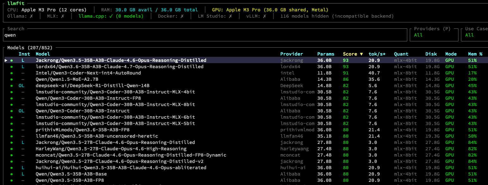
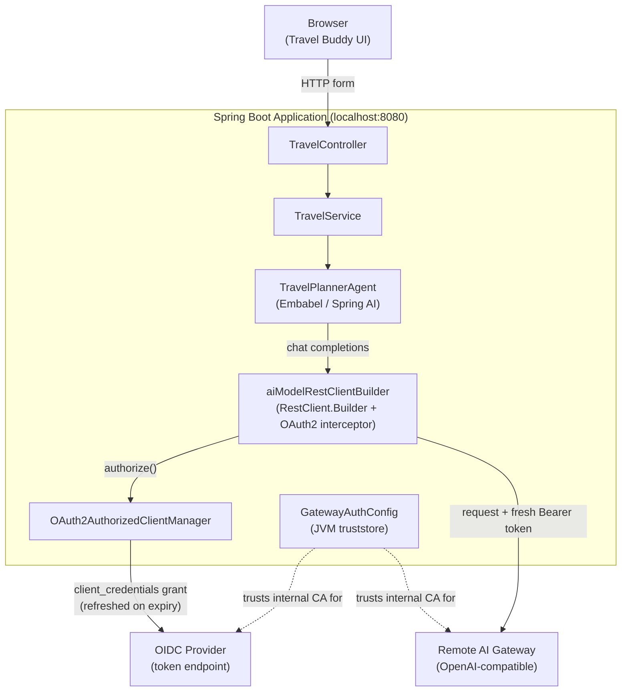
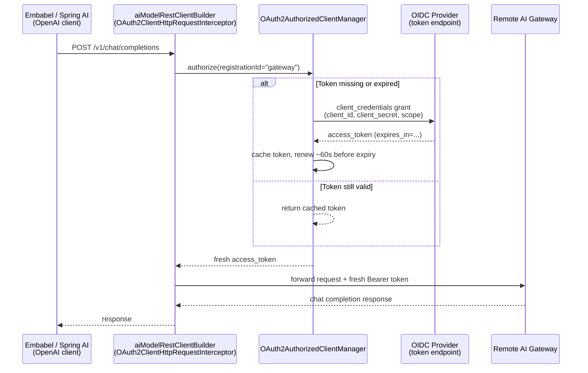

# 🗺️ Embabel Travel Buddy

An [Embabel](https://embabel.com) agent demo in top of [spring-boot](https://spring.io/projects/spring-boot) that suggests travel destinations based on user preferences, running against a local LLM served by [RamaLama](https://github.com/containers/ramalama).


> [Embabel](https://github.com/embabel/embabel-agent) (Em-BAY-bel) is a framework for authoring agentic flows on the JVM that seamlessly mix LLM-prompted interactions with code and domain models. Supports intelligent path finding towards goals. Written in Kotlin but offers a natural usage model from Java. From the creator of Spring.
 
 
> [RamaLama](https://ramalama.ai/) is a LI for running AI models in containers on your machine. Instead of manually managing model runtimes and dependencies, you plug into an existing container engine such as Podman or Docker ([Source](https://www.redhat.com/en/blog/run-containerized-ai-models-locally-ramalama)).

## Prerequisites

- Java 25+
- Maven
- RamaLama running locally with a compatible model (e.g. `tinyllama`,`llama3.2`)

Install ramalama with brew
```bash
$ brew info ramalama
==> ramalama ✔: stable 0.19.0 (bottled)
Goal of RamaLama is to make working with AI boring
(...)
```

Run a particular model with ramalama
```bash
$ ramalama serve tinyllama --port 11434 --name llama --max-tokens=2000 --thinking=False
0.19: Pulling from ramalama/ramalama
Status: Image is up to date for quay.io/ramalama/ramalama:0.19
(...)
main: server is listening on http://0.0.0.0:11434
srv  log_server_r: done request: POST /v1/chat/completions ::ffff:172.17.0.1 200
```

Example docker command invoked by ramalama behind the scenes
``` bash
docker run --rm --label ai.ramalama.model=ollama://library/granite3.1-dense:2b --label ai.ramalama.engine=docker \
  --label ai.ramalama.runtime=llama.cpp --label ai.ramalama.port=11434 --label ai.ramalama.command=serve \
  --security-opt=label=disable --cap-drop=all --security-opt=no-new-privileges --pull always -p 11434:11434 \
  --label ai.ramalama --name ramalama --env=HOME=/tmp --init quay.io/ramalama/ramalama:0.20 llama-server ˚
  --host :: --port 11434 --model /path/to/model --no-warmup --reasoning-budget 0 ˚
  --alias library/granite3.1-dense --temp 0.8 --cache-reuse 256
```

## Does Model <insert-fancy-LLM-here> run on my hardware?

Check out [llmfit](https://github.com/AlexsJones/llmfit) ...

> A terminal tool that right-sizes LLM models to your system's RAM, CPU, and GPU. Detects your hardware, scores each model across quality, speed, fit, and context dimensions, and tells you which ones will actually run well on your machine.

```
brew info llmfit
==> llmfit ✔: stable 0.9.19 (bottled), HEAD
Find what models run on your hardware
```



**NOTE:** RamaLama defaults to the Ollama registry transport. To make it easier for users, RamaLama uses shortname files, which contain aliases for fully specified AI Models, on brew-ramalama it's located in `/opt/homebrew/Cellar/ramalama/0.20.0/libexec/share/ramalama/shortnames.conf`, or just run `ramalama info`

## Running the app

```bash
$ mvn spring-boot:run
```
```bash
Powered by Spring Boot 3.5.13
12:30:52.169 [main] INFO  TravelApplication - Starting TravelApplication using Java 25.0.2 with PID 69558 2:30:52.170 [main] INFO  TravelApplication - No active profile set, falling back to 1 default profile: "default"
12:30:52.498 [main] INFO  OnMcpConnectionCondition - MCP connection condition NOT matched for [brave-search-mcp, fetch-mcp, wikipedia-mcp, docker-mcp] (...)
```

Then open [http://localhost:8080](http://localhost:8080) in your browser.

## What it does

Fill out the form with your travel preferences:

- **Region** — Americas, Southeast Asia, or Europe
- **Activities** — Hiking, Skiing, Diving, Beachtime, Culture, Shopping, Cycling (multi-select)
- **Additional Wishes** — any free-text notes (e.g. "family-friendly", "budget travel")

On submit, the app builds a prompt from your selections and invokes a single-step Embabel agent (`TravelPlannerAgent`) which asks the LLM for a concrete destination recommendation. The result is displayed on the next page.

## Example Agent & Service with Agent Invocation

```Java
// TravelPlannerAgent.java
@Agent(description = "Suggests a travel destination based on region, activities, and additional wishes")
public class TravelPlannerAgent {

    @AchievesGoal(description = "Travel destination suggestion returned")
    @Action
    String suggestDestination(UserInput userInput, Ai ai) {
        return ai
                .withAutoLlm()
                .generateText(userInput.getContent());
    }
}
```

```Java
// TravelService.java
@Service
public class TravelService {

    private final AgentPlatform agentPlatform;

    public TravelService(AgentPlatform agentPlatform) {
        this.agentPlatform = agentPlatform;
    }

    public TravelResult plan(TravelRequest request) {
        String activitiesList = (request.activities() == null || request.activities().isEmpty())
                ? "no specific activities"
                : String.join(", ", request.activities());

        String prompt = """
                You are an expert travel consultant. Based on the following traveler preferences, suggest ONE specific travel destination and explain in 3-5 sentences why it is a great fit.
                If you don't know, say you don't know. Do not guess!
                
                Region preference: %s
                Desired activities: %s
                Additional wishes: %s
                
                Provide a concrete destination name and a compelling, personalized recommendation.
                """.formatted(request.region(), activitiesList,
                request.additionalWishes().isBlank() ? "none" : request.additionalWishes()).trim();

        String suggestion = AgentInvocation
                .create(agentPlatform, String.class)
                .invoke(new UserInput(prompt));

        List<String> activities = request.activities() == null ? List.of() : request.activities();
        return new TravelResult(suggestion, prompt, request.region(), activities, request.additionalWishes());
    }
}

```

## Configuration

Key LLM settings in `src/main/resources/application.properties`:

| Property                                        | Description                                                                                |
|-------------------------------------------------|--------------------------------------------------------------------------------------------|
| `embabel.agent.platform.models.openai.base-url` | ramalama server URL, e.g. http://localhost:11434                                           |
| `embabel.models.default-llm`                    | Model name as reported by ramalama (`/v1/models`), e.g. gpt-4.1-mini                       |
| `embabel.agent.logging.personality`             | Optional themed logging (`starwars`, `hitchhiker`, `montypython`, `severance`, `colossus`) |

To switch models, update `embabel.models.default-llm` in `application.properties` and add a matching entry in `src/main/resources/models/openai-models.yml`.

### Three configuration scenarios

| # | Scenario | Make target | Config |
|---|---|---|---|
| 1 | Local ramalama, no auth (default) | `make run` | `application.properties` (committed) |
| 2 | Mock OIDC + mock AI gateway, offline dev/testing | `make run-mock` | `application-mock.properties` (committed, non-sensitive, Spring profile `mock`) |
| 3 | Real remote AI gateway, OAuth2 bearer token | `make run-remote` | `./application-local.properties` (gitignored — you create this yourself) |

Scenarios 1 and 2 are safe to keep in version control (no secrets, everything
points at `localhost`). Scenario 3 requires real credentials and must **never**
be committed — `make run-remote` checks for `./application-local.properties`
(project root) and refuses to start with instructions if it's missing.

### Scenario 2: mock OIDC + AI gateway (no network access needed)

Useful for developing/testing the OAuth2 token-refresh logic
(`net.timafe.travel.gateway`) without a real gateway or identity provider —
see [mocks/README.md](mocks/README.md) and [CHALLENGES.md](CHALLENGES.md) for
background.

```bash
make run-mock   # starts mocks/mock_oidc.py + mocks/mock_gateway.py if not
                # already running (make mocks-start/-stop/-status), then runs
                # the app with -Dspring-boot.run.profiles=mock
```

### Scenario 3: real remote AI gateway (bearer-token auth)

Instead of a local ramalama server, the app can target a remote, OpenAI-compatible AI gateway that
requires a short-lived OAuth2 bearer token (`client_credentials` grant against an OIDC provider). This is
**opt-in and never committed**:

1. Copy the template to a gitignored local file **at the project root** (this is
   where `spring.config.import` looks for it, not `src/main/resources`):
   ```bash
   cp src/main/resources/application-local.properties.example application-local.properties
   ```
2. Fill in the gateway URL and credentials. The model is part of the gateway URL path, so `base-url`
   includes it (Embabel appends `/v1/chat/completions`):
   ```properties
   embabel.agent.platform.models.openai.base-url=https://<gateway-host>/<model>
   embabel.models.default-llm=<model-id-registered-in-openai-models.yml>
   gateway.auth.token-url=https://<oidc-provider-host>/realms/<realm>/protocol/openid-connect/token
   gateway.auth.client-id=<client-id>
   gateway.auth.client-secret=<client-secret>
   gateway.auth.scope=<scope>
   ```
3. Run with `make run-remote` (or `mvn spring-boot:run`). The app mints and **auto-refreshes** the
   token (they typically expire after a few minutes), attaching it to every LLM request — no helper
   script or restarts needed. See `net.timafe.travel.gateway` for the implementation.

Setting `gateway.auth.token-url` is what switches the app into gateway mode; without the local file
the default local-LLM behaviour is unchanged.


## OAuth2 client-credentials auth for short-lived gateway tokens

Spring AI (which Embabel builds on) normally reads its OpenAI-compatible `api-key` **once at
startup** and caches it for the lifetime of the JVM — fine for static API keys, but broken for
gateways that require OAuth2 bearer tokens that expire every few minutes.

Rather than routing requests through a local HTTP proxy, the app uses standard Spring Security
OAuth2 client machinery (`OAuth2AuthorizedClientManager` + `OAuth2ClientHttpRequestInterceptor`,
from `spring-boot-starter-oauth2-client`) wired directly into Embabel's HTTP client. This works
because Embabel's `OpenAiModelsConfig` looks up an `ObjectProvider<RestClient.Builder>` qualified
`"aiModelRestClientBuilder"` when building its underlying `OpenAiApi` client — `GatewayAuthConfig`
publishes exactly that bean with the OAuth2 interceptor attached, so every outbound LLM HTTP call
gets a freshly-minted bearer token, with no local proxy or dynamic `PropertySource` trickery
needed.

Certificate trust for a gateway/OIDC provider with an internal CA is a **separate, independent
concern**, solved via JVM-level truststore system properties (also in `GatewayAuthConfig`). See
[CERTIFICATES.md](CERTIFICATES.md).

### When is this needed?

| Situation | OAuth2 client wiring required? |
|---|---|
| Local ramalama, no auth | No |
| Remote gateway with a long-lived static API key | No — a plain `api-key` property works |
| Remote gateway with short-lived OAuth2/OIDC tokens (this repo's use case) | **Yes** — only way to inject a fresh token per request |
| Custom CA / certificate trust only, static token | No — JVM truststore config alone suffices |

It's gated behind `gateway.auth.token-url` and disabled by default; see
[CHALLENGES.md](CHALLENGES.md) for the full investigation and rejected alternatives, and
[gateway-proxy-removal.md](gateway-proxy-removal.md) for the design notes behind this approach
(which replaced an earlier local-proxy-based implementation).

### Component overview



> When targeting local ramalama instead (no OAuth2/OIDC, no custom CA), `Agent` talks directly to
> ramalama and the `Builder`, `Manager`, and `SSL` components are inactive (gated by
> `gateway.auth.token-url`).

### Communication flow



## Note on ramalama vs ollama

Despite the endpoint being `localhost:11434`, this app uses ramalama which speaks the **OpenAI wire protocol** — not the native Ollama protocol. The Embabel OpenAI starter (`embabel-agent-starter-openai`) is used accordingly.


## Web Resources

* [JCON2026 Talk "Comparing Agentic AI Frameworks for Java"](https://github.com/SandraAhlgrimm/ai-nutrition-planner/blob/main/slides.pdf)  (slides) and [ai-nutrition-planner sample app](https://github.com/SandraAhlgrimm/ai-nutrition-planner) (sourcecode) and [Agent Deeplink](https://github.com/SandraAhlgrimm/ai-nutrition-planner/blob/main/embabel/src/main/java/com/example/nutritionplanner/NutritionPlannerAgent.java)
* [🤖 Embabel Agent Examples
  ](https://github.com/embabel/embabel-agent-examples) for Kotlin and Java
* [Tripper: Embabel Travel Planner Agent](https://github.com/embabel/tripper) Sophisticated, realistic example application (from Embabel project)
* [Run containerized AI models locally with RamaLama](https://www.cedricclyburn.com/articles/ramalama-containerized-models) (good summary)
* [Build AI Agents in Java with Embabel: Step-by-Step Guide](https://bell-sw.com/blog/build-ai-agents-in-java-with-embabel-step-by-step-guide/) (good summary)
* [Baeldung: Creating an AI Agent in Java Using Embabel Agent Framework](https://www.baeldung.com/java-embabel-agent-framework) Brief coding Example
